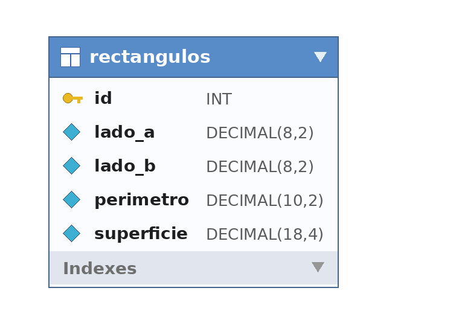
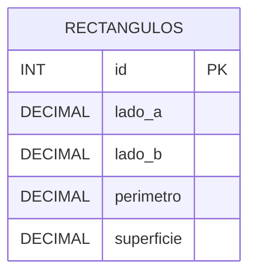

# Diagrama entidad-relación - Ejercicio 1

```mermaid
erDiagram
    RECTANGULOS {
        INT id PK
        DECIMAL lado_a
        DECIMAL lado_b
        DECIMAL perimetro
        DECIMAL superficie
    }
```

El ejercicio maneja una sola entidad, por lo que no hay relaciones con otras tablas.