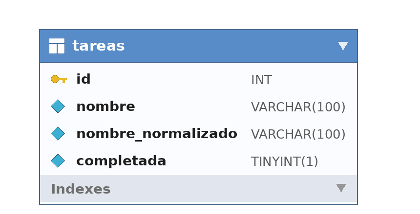
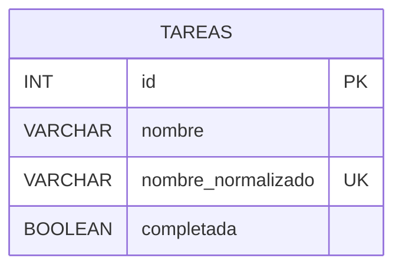

# Diagrama entidad-relación - Ejercicio 2

```mermaid
erDiagram
    TAREAS {
        INT id PK
        VARCHAR nombre
        VARCHAR nombre_normalizado UK
        BOOLEAN completada
    }
```

El ejercicio maneja una sola entidad, por lo que no hay relaciones con otras tablas.