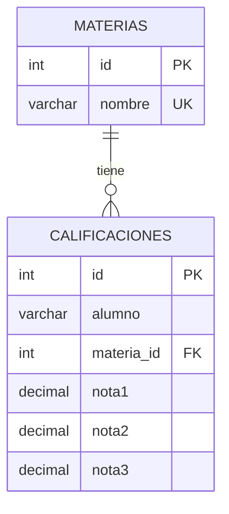

# Diagrama Entidad-Relación - Ejercicio 3

- Una materia puede tener muchos registros de calificaciones; cada registro pertenece a una sola materia (1:N).
- Restricción `UNIQUE (alumno, materia_id)`: un alumno no puede tener dos registros para la misma materia.
